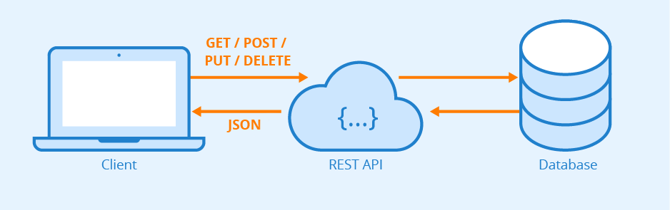

# Simple web Users Management System.

This project is a web Spring Boot application that uses RESTful API. It includes controller, responsible for the
resource named User and H2 databases for tests.



## Technologies Used

- Spring Boot 2.7
- Maven
- H2
- Java 17
- Hibernate
- RESTful API
- JUnit Mockito

## Public IP

[amazon EC2 Public IP]
(http://ec2-52-59-208-61.eu-central-1.compute.amazonaws.com:8080/)


## Controller (UserController)

Controller named **UserController** that handles CRUD operations for User. Below are the methods in the controller with
their descriptions:

## showAllUsers

http://ec2-52-59-208-61.eu-central-1.compute.amazonaws.com:8080/api/v1/users

- **Endpoint: /api/v1/users**
- **Method:** GET
- **Description:** Returns a list of all users.
- **Returns: List\<User\>** containing all users.
- **Logger Message:** Logs the retrieval of all users.

### Response:

```JSON
  {
  "data": {
    "links": [
      {
        "rel": "showAllUsers",
        "href": "http://localhost:8080/api/v1/users"
      }
    ],
    "content": [
      {
        "id": 1,
        "firstName": "Ronald",
        "lastName": "Serous",
        "email": "sewewt@code.com",
        "birthDate": "2000-04-10",
        "address": "2194 Richmond Terrace Staten Island, NY  10302",
        "phoneNumber": "+130020050002",
        "links": [
          {
            "rel": "self",
            "href": "http://localhost:8080/api/v1/users/1"
          }
        ]
      },
      {
        "id": 2,
        "firstName": "Ronald",
        "lastName": "Serous",
        "email": "sewewtw@code.com",
        "birthDate": "2000-04-10",
        "address": "2194 Richmond Terrace Staten Island, NY  10302",
        "phoneNumber": "+130020050002",
        "links": [
          {
            "rel": "self",
            "href": "http://localhost:8080/api/v1/users/2"
          }
        ]
      }
    ]
  }
}
```

## getUserById

http://ec2-52-59-208-61.eu-central-1.compute.amazonaws.com:8080/api/v1/users/

- **Endpoint: /api/v1/users/{userId}**
- **Method:** GET
- **Description:** Finds a user by their ID.
- **Parameters:**
    - **userId:** Path variable representing the ID of the user.
- **Returns: User** object representing the found user.
- **Logger Message:** Logs the retrieval of a user by ID.

### Response:

```JSON
{
  "data": [
    {
      "id": 2,
      "firstName": "Ronald",
      "lastName": "Serous",
      "email": "sewewtw@code.com",
      "birthDate": "2000-04-10",
      "address": "2194 Richmond Terrace Staten Island, NY  10302",
      "phoneNumber": "+130020050002",
      "links": [
        {
          "rel": "self",
          "href": "http://localhost:8080/api/v1/users/2"
        },
        {
          "rel": "allUsers",
          "href": "http://localhost:8080/api/v1/users"
        }
      ]
    }
  ]
}
```

## createUser

http://ec2-52-59-208-61.eu-central-1.compute.amazonaws.com:8080/api/v1/users

- **Endpoint: /api/v1/users**
- **Method:** POST
- **Description:** Creates a new user.
- **Request Body: User object containing the details of the new user.
    - **Note**: The user's `ID` is automatically generated and does not need to be provided.
- **Returns: User** object representing the newly created user.
- **Logger Message:** Logs the creation of a new user.

### Response:

```JSON
{
  "data": {
    "id": 3,
    "firstName": "firstName",
    "lastName": "lastName",
    "email": "emaildd@code.com",
    "birthDate": "2002-07-30",
    "address": "address",
    "phoneNumber": "+38090000000",
    "links": [
      {
        "rel": "self",
        "href": "http://localhost:8080/api/v1/users/3"
      },
      {
        "rel": "allUsers",
        "href": "http://localhost:8080/api/v1/users"
      }
    ]
  }
}
```

### Response Error:

```JSON
{
  "error": {
    "status": 400,
    "message": "Email already exists",
    "timeStamp": "2024-04-30T12:27:32.373+00:00"
  }
}
```

## updateUserFields

http://ec2-52-59-208-61.eu-central-1.compute.amazonaws.com:8080/api/v1/users/

- **Endpoint: /api/v1/users/{userId}**
- **Method:** PATCH
- **Description:** Updates fields of an existing user. The main requirement is that the ID field must be filled.
- **Parameters:** ***userId:*** Path variable representing the ID of the user to update.
- **Request Body: User** object containing the updated details of the user.
- **Returns: User** object representing the updated user.
- **Logger Message:** Logs the updating of user fields.

### Response:

```JSON
{
  "data": {
    "id": 3,
    "firstName": "first-Name",
    "lastName": "last-Name ",
    "email": "emaildd@code.com",
    "birthDate": "2002-07-30",
    "address": "address",
    "phoneNumber": "+38090000000",
    "links": [
      {
        "rel": "self",
        "href": "http://localhost:8080/api/v1/users/3"
      },
      {
        "rel": "allUsers",
        "href": "http://localhost:8080/api/v1/users"
      }
    ]
  }
}
```

## deleteUser

http://ec2-52-59-208-61.eu-central-1.compute.amazonaws.com:8080/api/v1/users/

- **Endpoint: /api/v1/users/{userId}**
- **Method:** DELETE
- **Description:** Deletes a user by their ID.
- **Parameters:**
    - **userId:** Path variable representing the ID of the user to delete.
- **Returns: GeneralResponse** object containing a message confirming the deletion.
- **Logger Message:** Logs the deletion of a user by ID.

### Response:

```JSON
{
  "data": {
    "status": 200,
    "message": "Users with id: 3 was deleted successfully.",
    "timeStamp": "2024-04-30T12:22:58.953+00:00",
    "links": [
      {
        "rel": "allUsers",
        "href": "http://localhost:8080/api/v1/users"
      }
    ]
  }
}
```

## searchByBirthDateRange

http://ec2-52-59-208-61.eu-central-1.compute.amazonaws.com:8080/api/v1/users/search

- **Endpoint: /api/v1/users/search**
- **Method:** GET
- **Description:** Searches for users by birth date range.
- **Parameters:**
  --from: Start date of the birth date range.
  --to: End date of the birth date range.
- **Returns: List<User>** containing users within the specified birth date range.
- **Logger Message:** Logs the search for users by birth date range.

### Response:

```JSON
{
  "data": {
    "links": [
      {
        "rel": "showAllUsers",
        "href": "http://localhost:8080/api/v1/users"
      }
    ],
    "content": [
      {
        "id": 1,
        "firstName": "Ronald",
        "lastName": "Serous",
        "email": "sewewt@code.com",
        "birthDate": "2000-04-10",
        "address": "2194 Richmond Terrace Staten Island, NY  10302",
        "phoneNumber": "+130020050002",
        "links": [
          {
            "rel": "self",
            "href": "http://localhost:8080/api/v1/users/1"
          }
        ]
      },
      {
        "id": 2,
        "firstName": "Ronald",
        "lastName": "Serous",
        "email": "sewewtw@code.com",
        "birthDate": "2000-04-10",
        "address": "2194 Richmond Terrace Staten Island, NY  10302",
        "phoneNumber": "+130020050002",
        "links": [
          {
            "rel": "self",
            "href": "http://localhost:8080/api/v1/users/2"
          }
        ]
      }
    ]
  }
}
```
### Response Error:
```JSON
{
  "error": {
    "status": 400,
    "message": "Birth Date range is wrong. Write correct rang.",
    "timeStamp": "2024-04-30T12:32:36.442+00:00"
  }
}
```

## User

- **Fields**:
    - `id` (Long)
    - `firstName` (String)
    - `lastName` (String)
    - `email` (String)
    - `birthDate` (LocalDate)
    - `address` (String)
    - `phoneNumber` (String)

## Validation in User

The User class includes validation annotations to ensure data integrity when saving a new user. Here are the
validations applied:

- **firstName:** Cannot be empty (@NotBlank) and is required.
- **lastName:** Cannot be empty (@NotBlank) and is required.
- **email:** Cannot be null (@NotNull) and is required. Must be a valid email format (@Email) following the
  pattern ^[a-zA-Z0-9._-]+@[a-zA-Z]+\\.[a-zA-Z.]{2,5}.
- **birthDate:** Cannot be null (@NotNull) and is required. Must be a past date (@Past), indicating that the birth date
  must be earlier than the current date.
- **address:** No specific validation applied;
- **phoneNumber:** Can be empty. If provided, it must follow the pattern ^\\+[0-9]{12,13}$, allowing only
  numbers and a maximum of 13 characters.

